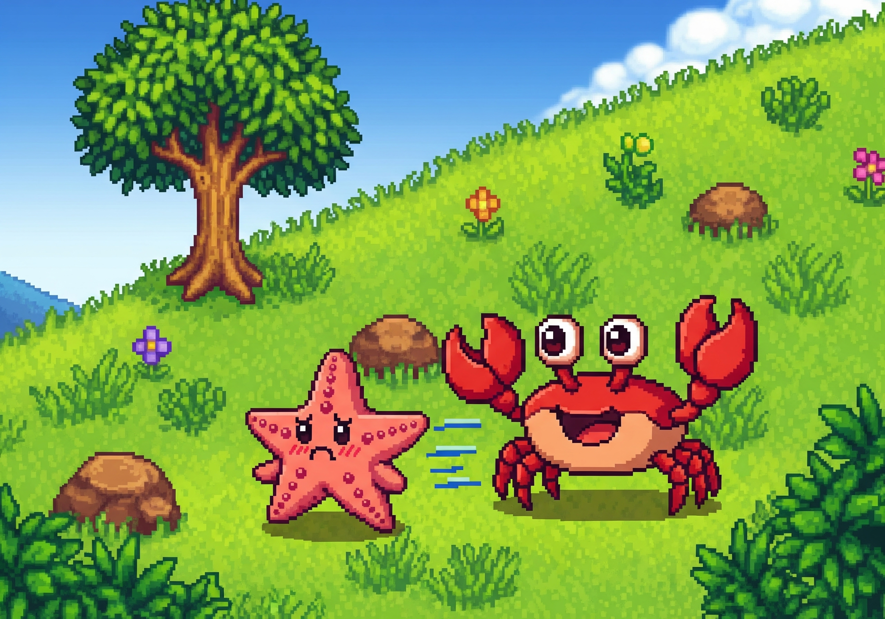

# Escape From Crabby 🦀🔥

## 🎮 Sobre o jogo  
Ah, não! Esses caranguejos famintos acharam o esconderijo da estrela do mar e agora não a deixam mais em paz. Ajude ela a escapar!  
Em “Escape From Crabby”, os inimigos vão perseguir você com animações fluidas, criando uma atmosfera tensa e cheia de ação e diversão. Com um menu de botões para começar a jogar, ligar/desligar a música e sair do jogo, a experiência fica completa e simples de usar.

## 🎵 Música e sons  
- Música de fundo: **Game Over** by Various Artists (Enough Records) — disponível no Free Music Archive  
- Efeito sonoro: **Cyber Punch 03, Punch with cyber texture** by JohnLoser

## 🚀 Funcionalidades  
- Menu principal com botões clicáveis para começar, controlar música e sair  
- Herói e inimigos animados, com sprites para movimento e parada  
- Inimigos que se movimentam dentro de seus territórios e perseguem o herói  
- Sistema de vida e morte com animação para o herói

## 🛠️ Tecnologias usadas  
- Python com PgZero  
- Bibliotecas: matemática, aleatória e Rect do pygame  

## 🧑‍💻 Sobre a desenvolvedora  
Este jogo foi criado por Ana Carolina de Andrade como parte de um desafio de programação para mostrar domínio em Python e desenvolvimento de jogos simples e eficientes.  

Divirta-se jogando e não se esqueça: fique longe do Crabby! 🦀🔥

---

**Para rodar o jogo:**  
1. Tenha Python instalado com PgZero configurado  
2. Coloque a pasta do projeto no seu computador  
3. Execute o arquivo `roguelike_skeleton.py` com PgZero (ex: `pgzrun roguelike_skeleton.py`)  
4. Curta a aventura!

---
